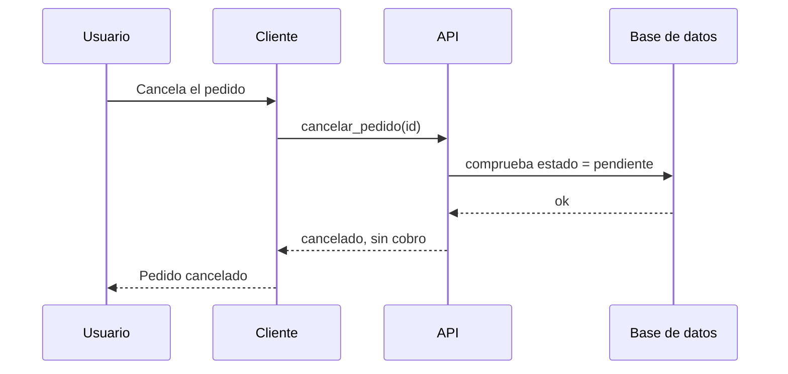

# Flujos

Cómo se recorre el sistema de punta a punta: qué pantalla, qué llamada, qué dato cambia y **quién
decide cada regla**. Un archivo por flujo: `F-NN-nombre-corto.md`.

| Flujo | Recorre |
|---|---|
| {{`F-01-nombre.md`}} | {{qué recorre}} |

## Plantilla

Todos siguen las mismas secciones y en el mismo orden, para que se lean como uno solo:

1. **Encabezado**: actores, disparador, precondiciones, y las historias que recorre (`US-NNN`).
2. **Recorrido**: tabla `paso · superficie · artefacto · efecto en datos · control de acceso`.
3. **Diagrama**: `sequenceDiagram` con los participantes fijos de abajo. Unos 25 mensajes como
   máximo: si hay más, se parte en dos.
4. **Estados**: solo donde hay una máquina de estados.
5. **Quién decide qué**: tabla `regla · la valida el cliente · la valida el servidor · nadie`.
6. **Comportamiento degradado**: sin red, sin permiso, sesión caducada, proceso muerto.
7. **Lagunas conocidas**: enlaces a `AUD-NNN`, sin repetir su descripción.

**La sección 5 es la importante.** Una fila con las dos primeras columnas vacías y la tercera
marcada es un hueco de seguridad sin necesidad de argumentarlo. Y una regla que solo aparece en esta
tabla —o en la de comportamiento degradado— y en ningún criterio, no la comprueba nadie: va a
[`REGLAS-SIN-HISTORIA.md`](../specs/REGLAS-SIN-HISTORIA.md).

**Participantes fijos** en los diagramas: {{`Usuario`, `Cliente`, `API`, `Base de datos`,
`Almacenamiento`, `Gestor`}}.

Ejemplo de diagrama:

Cada flujo termina con **Verificado sobre**: commit y fecha, y si se reconstruyó leyendo el código o
ejecutándolo.
