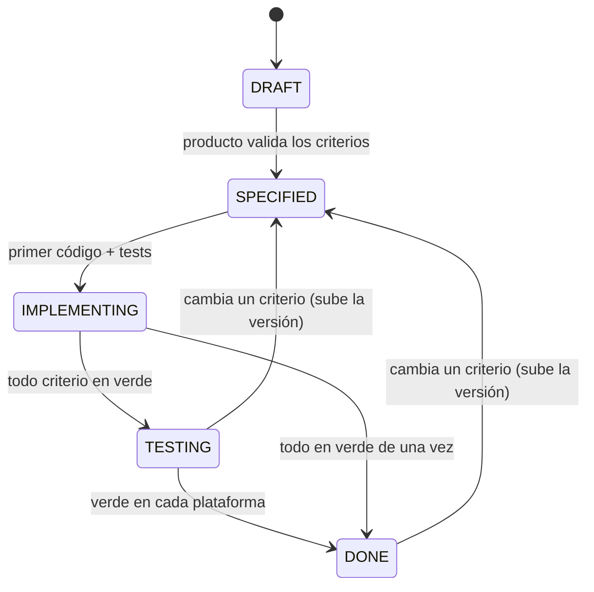

# Especificaciones

**Esta carpeta es la fuente de verdad de qué debe hacer el sistema.** El código es una
implementación de lo que aquí se dice; cuando discrepan, el que está mal es el código.

Antes de escribir una historia, mira el [glosario](../GLOSARIO.md). Una historia vale para
**todas** las plataformas que declara: los clientes no son productos distintos, son formas de
acceder a la misma regla de negocio. Escribir una historia por plataforma es como nacen las
divergencias que luego nadie sabe explicar.

## El problema que esto resuelve

Que la especificación sea Markdown no basta. Se escribe un `.md`, el código acaba haciendo otra
cosa, y nadie se entera. Por eso la cadena no termina en el documento:

```
Historia → Criterio de aceptación → Test que lo demuestra → Veredicto (se ejecutó y pasó)
```

La especificación dice lo que debe ocurrir; **el test demuestra que ocurre**; y un guardián
(`node herramientas/trazabilidad.ts`) comprueba que la cadena no se rompe, leyendo el **veredicto**
de los tests en sus JUnit XML, no solo su nombre.

**Lo que NO garantiza:** que el test *pruebe de verdad* el criterio. Un test puede pasar sin
comprobar nada relevante; la detección de tests sin aserciones tapa el caso burdo, y demostrarlo en
general exige análisis de mutación. El guardián evita que la spec mienta por omisión, no que un test
mienta por vacío.

## Formato

Un archivo por historia, en `docs/specs/<AREA>/<nombre-corto>.md`. Ejemplo completo, con un
criterio activo y uno retirado: [`EJEMPLO/historia-ejemplo.md`](EJEMPLO/historia-ejemplo.md).

```markdown
---
id: US-001
titulo: Registrar la entrada
area: EJEMPLO
estado: SPECIFIED
plataformas: [android, backend]
version: 1
---

Como trabajador
quiero registrar mi entrada
para que quede constancia de cuándo empecé a trabajar.

## Criterios de aceptación

### AC-001-01 · Sin una posición válida no se marca
Dado que voy a marcar entrada
cuando el dispositivo no puede dar una posición válida
entonces la marca no se registra y se me explica el motivo concreto.

- **Aplicada en:** servidor+cliente
- **Notas:** el porqué, el contexto. Nunca una regla: si se puede incumplir, es criterio.

## Fuera del alcance de esta historia
```

### Campos del encabezado

| Campo | Regla |
|---|---|
| `id` | `US-NNN`. **Nunca se reutiliza ni se reordena.** Se numera por bloques de área (p. ej. ACCESO 001+, PEDIDOS 030+…) para que el número diga de qué se habla. |
| `titulo` | Lo que el usuario consigue, en su lenguaje. |
| `area` | La carpeta. |
| `estado` | Ver [los estados](#los-estados). El archivo es el **único** dueño del estado. |
| `plataformas` | Solo las que de verdad implementan la historia. |
| `version` | Sube cuando cambia comportamiento ya aprobado. El `id` no cambia. |
| `sustituida_por` | Solo si la historia se parte o se retira. |

Debajo del «Como… quiero… para que…», las versiones se anotan como citas, la más reciente arriba:
`> **v3 (AAAA-MM-DD):** qué cambió y por qué; qué criterios nacen o se retiran.` El historial
completo lo guarda git; aquí solo va el qué y el porqué.

### El criterio

- `### AC-NNN-MM · Título`, donde `NNN` es el número de la historia. El guardián comprueba que casen.
- Cuerpo en **Dado / cuando / entonces**, con la parte comprobable en negrita si ayuda.
- `- **Aplicada en:**` — obligatorio. Ver abajo.
- `- **Notas:**` — opcional: contexto y porqué. **Nunca** una regla.
- **Sin rutas de test.** Quién demuestra cada criterio lo dice la matriz: escribirlo también aquí
  sería un dato con dos dueños, y el de aquí envejece con cada refactor.

## Los estados

| Estado | Significa | Entra cuando | Lo mueve | El guardián exige |
|---|---|---|---|---|
| `DRAFT` | Se está escribiendo. Producto no ha validado los criterios | Se crea | Quien escribe | Nada: avisa |
| `SPECIFIED` | Criterios validados por producto. **Aún no hay código** | Producto los valida | Producto | Nada: avisa. Si algún criterio ya pasa, avisa de que el estado miente |
| `IMPLEMENTING` | Hay código en al menos una plataforma | El primer cambio con código y tests | Quien implementa, en ese cambio | Que **ningún** test falle; lo que aún falta, avisa |
| `TESTING` | Todo criterio pasa; falta alguna plataforma declarada | El cambio que deja todo en verde | Quien implementa | **Todo** criterio en verde |
| `DONE` | Verde en todas las plataformas declaradas con runner | El guardián lo confirma | Quien integra | Todo en verde **y** un test verde por plataforma |



La exigencia es **gradual** a propósito. Si `IMPLEMENTING` ya lo exigiera todo, promover una
historia a medio implementar rompería el guardián, y la salida cómoda sería no promoverla nunca: el
estado dejaría de decir la verdad. El guardián sugiere cada promoción cuando se cumple.

## `Aplicada en:` — el campo que más información da

Dice **dónde se hace cumplir** la regla, que no es lo mismo que dónde se muestra:

| Valor | Significa |
|---|---|
| `servidor` | La impone el servidor (base de datos, RPC, API). El cliente puede adelantar el mensaje, pero la decisión no es suya. |
| `servidor+cliente` | El servidor decide y el cliente repite la comprobación para dar un error inmediato. **Cambiar la regla obliga a tocar los dos sitios.** |
| `solo cliente` | Nadie la impone en el servidor. **Obliga a justificarse**: `solo cliente · <motivo>`, o el `AUD-NNN` que lo recoge. |

Un criterio `solo cliente` que proteja datos o permisos **es un hallazgo de seguridad**: cualquiera
que hable directamente con la API se lo salta. Va a la [auditoría](../auditoria/hallazgos.md).

## Cómo se etiqueta un test

El identificador del criterio va en el **nombre** del test. Los tests se quedan donde su herramienta
los espera; no se mueve ningún archivo.

| Stack | Forma |
|---|---|
| Kotlin / JUnit | ``@Test fun `AC-001-02 el servidor lo impone`()`` |
| Vitest / Jest | `it('AC-001-02 el servidor lo impone', …)`, o `describe('AC-001-02 …')` para todos sus `it` |
| Playwright | `test('AC-001-02 …', …)` |
| SQL | `-- AC-001-02` en la cabecera del fichero, o como inicio de un comentario de sección: `-- ── AC-001-02 · … ──` |
| Script de comprobación | una aserción cuyo mensaje **empieza** por el id: `exigir(cond, 'AC-001-02 …')` |

**Citar el id en un comentario o a mitad de una frase no cuenta como cobertura**: el guardián lo
reporta como mención. Un test etiquetado sin ninguna aserción es un fallo. Un test que nombra un
criterio que ninguna historia declara es un huérfano, y también es un fallo.

## La matriz

[`TRAZABILIDAD.md`](TRAZABILIDAD.md) la genera CI y se commitea para leerla en el repositorio.
**No se edita a mano, y tras un merge no se resuelve a mano**: el `.gitattributes` se queda con una
de las dos versiones, y si CI dice que no coincide, `node herramientas/traer-matriz.ts` trae la
buena. Fuera de CI el guardián no la escribe: los veredictos solo son fiables donde corren todas
las suites.

## Cómo se retira un criterio

Retirar una regla es tan delicado como escribirla:

1. **El criterio no se borra: se convierte en lápida.** Conserva su número —que **nunca** se
   reutiliza—, tacha su título y añade `- **Retirado:** vN, fecha · ADR`, qué decía y por qué se
   fue.
2. **Sus tests desaparecen o se reescriben en el mismo commit.** Si la regla nueva es lo contrario de
   la vieja, lo natural es reescribirlos a nombre del criterio nuevo.
3. **La comprobación se invierte.** A un criterio retirado el guardián no le exige un test verde: le
   exige **no aparecer en ningún fichero de test, ni en un comentario**. La lápida es ejecutable:
   nada reintroduce por la puerta de atrás lo que se decidió retirar.
4. **La historia sube de `version`** y lo anota en su cabecera.
5. **Casi siempre exige un ADR**: retirar una regla es una decisión, no una corrección.

## Ciclo de trabajo

1. Editar el criterio en la historia.
2. El guardián señala los tests afectados y los criterios sin cobertura.
3. Actualizar los tests. Ahora fallan: es la señal de que el cambio es real.
4. Implementar en las plataformas declaradas.
5. Tests en verde, guardián en verde, estado de la historia actualizado en el mismo cambio.

## Reglas que aún no tienen historia

Las reglas que el sistema ya aplica y ninguna historia recoge se anotan en
[`REGLAS-SIN-HISTORIA.md`](REGLAS-SIN-HISTORIA.md). No es un backlog: es la lista de trabajo para
escribir historias, y existe para que esa deuda sea contable en vez de disolverse. Al tocar un área,
primero se escriben sus reglas como criterios y se borran de allí.

## Áreas

| Área | Cubre |
|---|---|
| [`EJEMPLO/`](EJEMPLO/README.md) | El ejemplo del kit. Bórralo cuando tengas tu primera área real |

## Adoptar el método en código que ya existe

**No se especifica todo de golpe**: sería paralizante y produciría documentos que nadie ha
verificado. Se escribe la historia de un área cuando se cumple una de dos: **se va a tocar esa
área**, o **hay un hallazgo de auditoría que fijar ahí**. Los tests de extremo a extremo que ya
existan se adoptan renombrándolos a `AC-NNN-MM`, no se reescriben.
